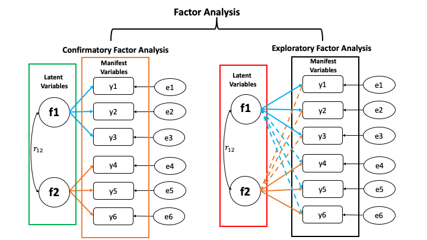

```{r setup, include=FALSE}
options(htmltools.dir.version = FALSE)

library(plotly)
library(tidyverse)
library(htmlwidgets)
```


# Motivation: High dimensional and diverse phenotypes


---
# How to handle a large number of phenotypes?
More and more phenotypes are being generated across time and space


Challenges:
- high dimensional phenotypes
- diverse phenotypes
- how to make sense of these data and interpret
- multi-trait linear mixed model is computationally challenging

Objective:
- leverage Bayesian confirmatory factor analysis and Bayesian network to characterize a wide spectrum of rice phenotypes

---
# Bayesian confirmatory factor analysis
Assume observed phenotypes are derived from underlying latent variables

\begin{align*}
    \mathbf{T} =  \mathbf{\Lambda} \mathbf{F} + \mathbf{s}
\end{align*}
  
- $\mathbf{T}$ is the $t \times n$ matrix of observed phenotypes (413 accessions)

- $\mathbf{\Lambda}$ is the $t \times q$ factor loading matrix

- $\mathbf{F}$ is the $q \times n$ latent variables matrix

- $\mathbf{s}$ is the $t \times n$ matrix of specific effects.

Variance-covariance model: 
\begin{align*}
    var\mathbf{(T)} &= \mathbf{\Lambda}\mathbf{\Phi}\mathbf{\Lambda}' + \mathbf{\Psi},
\end{align*}


- $\mathbf{\Phi}$ is the variance of latent variables

- $\mathbf{\Psi}$ is the variance of specific effects

---
# Prior distributions 

\begin{align*}
    var\mathbf{(T)} &= \mathbf{\Lambda}\mathbf{\Phi}\mathbf{\Lambda}' + \mathbf{\Psi},
\end{align*}

- Factor loading matrix: 
\begin{align*}
& \mathbf{\Lambda} \sim \mathcal{N}(0, 0.01)
\end{align*}

- Variance of latent variables:
\begin{align*}
\mathbf{\Phi} \sim \mathcal{W}^{-1}(\mathbf{I}_{66}, 7) 
\end{align*}

- Variance of specific effects:
\begin{align*}
\mathbf{\Psi} \sim \Gamma^{-1} (1, 0.5)
\end{align*}
---
# Define 6 latent variables from 48 phenotypes


1. Grain Morphology (Grm, 11)
    - Seed length (Sl), Seed width (Sw), Seed volume (Sv), etc
2. Morphology (Mrp, 14)
    - Flag leaf length (Fll), Flag leaf width (Flw), etc
3. Flowering Time (Flt, 7)
    - Flowering time in Arkansas (Fla), Flowering time in Aberdeen (Flb), etc
4. Ionic components of salt stress (Iss, 6) 
    - Na shoot (Nas), K shoot salt (Kss), etc
5. Yield (Yid, 5)
    - Panicle number per plant (Pnu),   Panicle length (Pal), etc
6. Morphological salt response (Msr, 5)  
    - Shoot BM ratio (Sbr), Root BM ratio (Rbr), etc

---
# Study the genetics of each latent variable


---
# Multivariate analysis
Bayesian genomic best linear unbiased prediction
    - separate genetic effects from noise (44K SNPs)
    
\begin{align*}
    \mathbf{F} = \boldsymbol{\mu} + \mathbf{Xb} + \mathbf{Zu} + \boldsymbol{\epsilon}
\end{align*}

<div align="center">    

</div>

- $\mathbf{F}$ : Vector of factor scores
- $\mathbf{X}$ : Incidence matrix for fixed effects 
- $\mathbf{Z}$ : Incidence matrix for additive genetic effects
- $\mathbf{b}$: Vector of fixed effects
- $\mathbf{u}$: Vector of additive genetic effects
- $\mathbf{e}$: Vector of residuals

---
# Piror distributions
\begin{align*}
    \mathbf{F} = \boldsymbol{\mu} + \mathbf{Xb} + \mathbf{Zu} + \boldsymbol{\epsilon}
\end{align*}

<div align="center">    

</div>
- $\mathbf{\mu}$, $\mathbf{b}$ were assigned a flat prior

- $\boldsymbol{\Sigma_{u}}$, $\boldsymbol{\Sigma_{e}}$ are variance-covariance matrix between latent variables


\begin{align*}
\boldsymbol{\Sigma_{u}}, \boldsymbol{\Sigma_{e}} \sim \mathcal{W}^{-1}(\mathbf{I}_{66}, 6) 
\end{align*}


---
# Bayesian Network
Probabilistic directed acyclic graphical model (DAG)
    - interrelationships (Edges) among latent variables (Nodes)
    - genetic selection for breeding requires causal assumptions

<div align="center"> 

</div>
---
# Constraint-based learning


---
# Score-based learning


---
# Examples of algorithms 
- Score-based algorithm
  - Hill climbing 
  - Tabu search

- Hybrid algorithm
  - Max-Min Hill Climbing algorithm
  - General 2-Phase Restricted Maximization algorithm
---
# Standardized factor loadings
<div align="center"> 

</div>
---
# Standardized factor loadings
<div align="center"> 

</div>

---
# Genetic correlations among latent variable
<div align="center"> 

</div>
---
# Hill Climbing algorithm


---
# Tabu algorithm


---
# Max-Min Hill Climbing algorithm


---
# General 2-Phase Restricted Maximization algorithm


---
# Consensus Bayesian network


---
# FA vs. PCA

- What is the main difference between principal component analysis (PCA) and factor analysis (FA)? 

- Confirmatory factor analysis (CFA) vs. Explanatory factor analysis (EFA)

---
# CFA vs. EFA
<div align="center">

</div>

<!-- # CFA vs. EFA -->
<!-- Wheat Data structure (CFA) : -->
<!-- <div align="center">  -->
<!--  -->
<!-- </div> -->

<!-- --- -->
<!-- # CFA vs. EFA -->
<!-- Bayesian Network (CFA) -->

<!-- --- -->
<!-- # CFA vs. EFA -->
<!-- Number of factors in EFA:  -->
<!-- <div align="center">  -->
<!--  -->
<!-- </div> -->

<!-- --- -->
<!-- # CFA vs. EFA -->
<!-- Bayesian Network of EFA:  -->

<!-- --- -->
<!-- # CFA vs. EFA -->
<!-- Factor loading of EFA: -->

---
# Summary

- Bayesian cofirmatory factor analysis allows to work at the
level of latent variables

- Bayesian network can be applied to predict the potential influence of external interventions or selection associated with target traits

- Provide greater insights than pairwise-association measures of multiple phenotypes

- It is possible to dissect genetic signals from high-dimensional phenotypes if we focus on underlying patterns in big data

---
# Useful links
<div align="center">

</div>

- Genomic Bayesian confirmatory factor analysis and Bayesian network to characterize a wide spectrum of rice phenotypes (https://www.g3journal.org/content/9/6/1975)

- An illustrative example of Bayesian Network (https://haipengu.github.io/Rmd/GBN.html)

